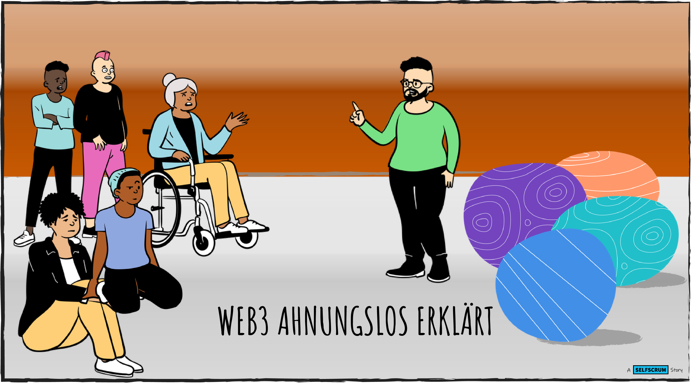

+++
title = "SELFSCRUM goes web3"
outputs = ["Reveal"] 
weight=10
+++



<h3 style="color: #000;">SELFSCRUM goes Crypto</h3>

---



## Why?

* Within education, we have an urgent need towards self-directed learning.
* We see that the current education system is unable to reform itself.
* Web3 unlocks a big potential for new, networked, independent organizations.
* The knowledge chasm between those two domains is incredible deep.
* This initiative aims to connect both worlds with a learning experience.

---


<h3 style="color: #FFF;">First Baby Steps</h3>

 

Stay tuned - and check our <a href="https://www.selfscrum.org/en/blog"  style="color: #FFF;text-decoration: underline;">regular web site</a> too :)

