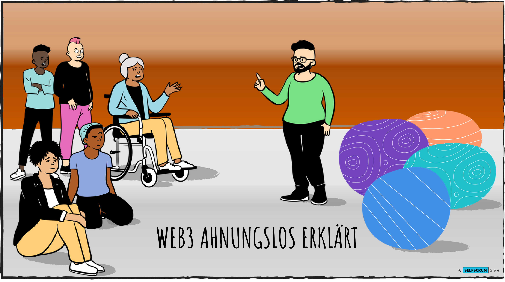

+++
title = "SELFSCRUM goes web3"
outputs = ["Reveal"] 
weight=10
+++



<h3 style="color: #000;">SELFSCRUM goes Crypto</h3>

---



## Warum?

* Web3 ist eine junge Technologie.
* Hierzulande haben viele kein Wissen darüber.
* Das wollen wir ändern.

---
